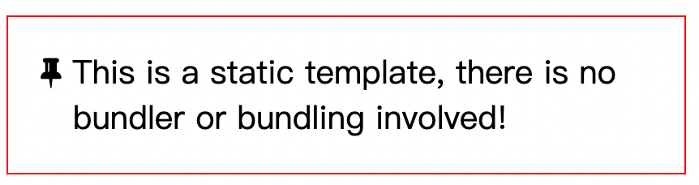
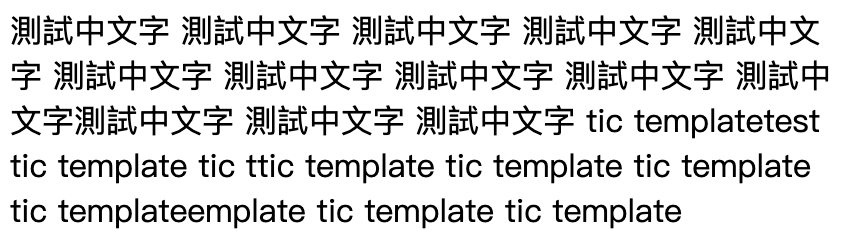
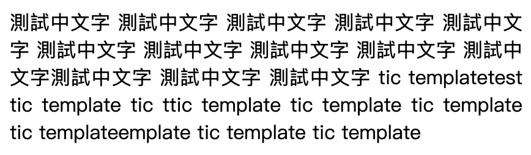
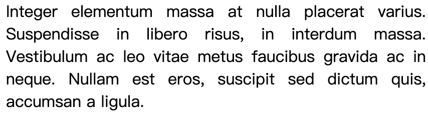

# CSS

### text-indent

- 利用 `text-indent` 的負值讓第一行凸出去

```html
<head>
  <style>
    p {
      border: solid 1px red;
      text-indent: -0.5em;
      padding: 1em 1em 1em 2em;
      font-size: 20px;
    }
  </style>
</head>
<body>
  <p>
    <i class="fa fa-thumb-tack"></i>
    <span
      >This is a static template, there is no bundler or bundling
      involved!</span
    >
  </p>
</body>
```

以上程式碼會呈現如下圖


### text-align

- 利用 `text-align` 的 justify 可以讓每一行都對齊，不會有幾行凸出去的情況
  - 當 `text-align` 為 `left`
    
  - 當 `text-align` 為 `justify`
    
    - 使用在英文上會讓英文單字間的空格變大，需要多注意
      

### linear-gradient

- `background-image: linear-gradient(#fff, #000);` 可以寫漸層顏色，也可以寫下漸層的方向或角度
  - `linear-gradient(to left, #fff, #000)` 由右開始白色漸層到左變黑色，第一個參數也可以填入 to right、to bottom right.....
  - `linear-gradient(115deg, #fff, #000)` 115 度開始從白色到黑色的漸層
  - `linear-gradient(115deg, #000, 10%, #fff)` 115 度開始由黑色開始 10% 的寬度後到白色的漸層

### background-repeat

- `background-repeat: round` 讓圖片 repeat 填滿且在不裁切到圖片的情況下填滿，但有機會會縮放到圖片，如果不要縮放到圖片就是用 `space`。(詳細圖片可見此 [教學](https://ithelp.ithome.com.tw/articles/10248942))

### background-size

- 最常用到的是 `contain` 和 `cover` 兩者都是等比例縮放且不變形圖片，但前者不裁切圖片；後者 `cover` 會有機會裁切到圖片。

### width

- 100vw 代表 100 的可視窗口寬度，所以當有側邊的捲軸時就會多出一小塊寬度，變成會有橫向捲軸，100% 因為是父層內可運用的寬度，也就是 padding 內的寬度，所以不會有橫向捲軸，
- `display: inline` 不支援 width 及 height

### margin

- `margin-left: 10%` 代表父層 width 的 10%

### padding

- `padding: 10%` 代表父層 width 的 10%（無論設定 padding 上下左右為 10% 都是取父層寬度的 10%）
- 當 width: 40% 及 `padding-bottom: 40%` 就能做出一個等比例的正方形，且可以 RWD 縮放，概念就是因為 width: 40% 會是以父層的 40% 當作寬度，再來 `padding-bottom: 40%` 也是以父層的寬度 40% 當作 `padding-bottom`

### right、bottom、top、left

- 需要搭配 `position` 設定 `right`、`bottom`、`top`、`left` 才有效，`position` 只要是 `static` 以外的都可以
- 當 `position: absolute` 或是`fixed`上，因為此屬性是將元素定位新的一層上，加上寫了`right` 及 `left` 後讓元素可以抓取到左右的空間，最後再寫 `margin: 0 auto` 就可以讓元素水平置中對齊，缺點是這個元素有要固定的寬高（用 % 數定義寬高也可以）
- 可以利用 `position: absolute` 加上 `right`、`bottom`、`top`、`left`，讓元素的寬高自行由目前內容去產生，做出一個蓋板廣告

### :empty

- 利用 `:empty` 選取到空的元素不要顯示在畫面上，也減少 JavaScript 的一個判斷

```css
.box:empty {
  display: none;
}
```

### 偽元素

- content: attr()
  - content 可以顯示多組內容，例如 `content: attr(test) "GOGO"`，就會去抓取屬性為 test 並加上「GOGO」來顯示出來
  - 用 `:after` 中 `content` 的 `attr` 取用屬性內容來顯示

```html
<head>
  <style>
    .box:after {
      content: attr(data-tip);
    }
  </style>
</head>
<body>
  <div class="box" data-tip="測試">test</div>
</body>

<!-- content 就可以取用到 data-tip 「測試」兩字的內容 -->
```

### table

- 利用 `table-layout: fixed` 讓表格等寬，需搭配 `width: 100%` 使用

```css
table {
  table-layout: fixed;
  width: 100%;
}
```

### 單位

- em：以倍數的方式乘上父元素的 px 值
- rem：以倍數的方式乘上根元素的 px 值
- %：以百分比的方式乘上父元素的 px 值（120% 等於 1.2em)
- px：絕對單位

### box-shadow

- 參數分別為 offset-x、offset-y、blur-radius、color，
  - offset-x 負值會顯示在元素左側
  - offset-y 負值會顯示在元素上方

### background-image

- 將遮罩直接寫在 `background-image` 上

```css
.box {
  background-image: linear-gradient(
      rgba(0, 0, 255, 0.5),
      rgba(255, 255, 0, 0.5)
    ), url("url");
}
```

### 參考資料

- [Text-indent - 金魚都能懂的 CSS 必學屬性](https://ithelp.ithome.com.tw/articles/10243388)
- [Text-align - 金魚都能懂的 CSS 必學屬性](https://ithelp.ithome.com.tw/articles/10243882)
- [Background-image 之二- 金魚都能懂的 CSS 必學屬性](https://ithelp.ithome.com.tw/articles/10248148)
- [Background-repeat- 金魚都能懂的 CSS 必學屬性](https://ithelp.ithome.com.tw/articles/10248942)
- [Background-size- 金魚都能懂的 CSS 必學屬性](https://ithelp.ithome.com.tw/articles/10249362)
- [width & height - 金魚都能懂的 CSS 必學屬性](https://ithelp.ithome.com.tw/articles/10251849)
- [margin & padding - 金魚都能懂的 CSS 必學屬性](https://ithelp.ithome.com.tw/articles/10252624)
- [Top、Right、Bottom、Left - 金魚都能懂的 CSS 必學屬性](https://ithelp.ithome.com.tw/articles/10253814)
- 金魚都能懂的 CSS 選取器（書）
- [CSS 專家密技 2 - CSS Protips - 阿莫斯の網頁料理室 | CSS 教學 | 新手網頁教學](https://www.youtube.com/watch?v=PiczFSV9xGg&list=PLqivELodHt3gYOrZe4oVUP4_TNRJunD5P&index=2&ab_channel=CSScoke)
- [一次搞懂 CSS 字體單位：px、em、rem 和 %](https://www.oxxostudio.tw/articles/201809/css-font-size.html)
- [MDN - box-shadow](https://developer.mozilla.org/zh-TW/docs/Web/CSS/box-shadow)
- [MDN - background-image](https://developer.mozilla.org/zh-CN/docs/Web/CSS/background-image)
