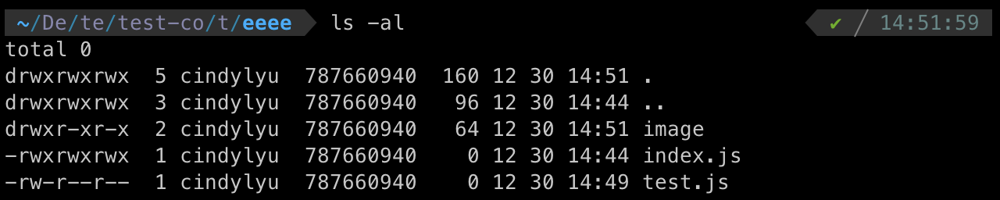

# Command Line

- `$ sudo chmod -R 777 [name]` 給與當前電腦所有使用者此資料夾或檔案最高權限
  - `sudo` 為 super user do
  - `chmod` 全名為 change mode
  - `-R` 遞迴讓底下的所有資料夾及檔案都有這樣的權限
  - `777` 代表擁有者、擁有者的群組、其他人都有可讀取、可寫入、可執行的權限（無敵狀態）
  - `755` 代表擁有者可讀取、可寫入、可執行；擁有者的群組和其他人可讀取和執行，但沒有寫入的權限
- `$ ls -al` 可以看到的當前底下的資料夾及檔案的權限及一些相關資料
  - `$ ls -a` 條列出所有檔案包含 .. 的隱藏檔
  - `$ ls -l` 條列出所有檔案並列出權限及格式等詳細資料
    
  - 第一欄位的內容說明權限
    - 有十碼，第一碼如果是 d 代表資料夾，如果是 - 代表檔案
    - 接下來的九碼，分別三個為一組，所以會有三組，這三組分別代表擁有者、擁有者的群組、其他人的權限，而內容可能會有 r、w、x、-
      - `r` read 讀取
      - `w` write 寫入
      - `x` execute 執行
      - `-` 沒有這個權限
      - 以上圖的最後一個 test.js 檔案為例，權限為 `-rw-r--r--`
        - 第一碼為 `-` 代表檔案
        - 第一組為 `rw-` 代表擁有者的權限為可讀、可寫、不可執行
        - 第二組為 `r--` 代表擁有的群組為可讀取、不可寫及不可執行
        - 第三組為 `r--` 同上，代表其他人為可讀取、不可寫及不可執行
- 查詢特定 port 是否有使用及他的 process ID（PID) `$ lsof -i :3001`
  - `lsof` list open files
  - `-i ` 使用 IPV[46] address 後面可以接 port 來查詢
- 終止 process ID `$ kill -9 <PID>`
  - `-9` 強制停止執行
  - `-15` 用正常的程序停止執行（預設，代表 `$ kill :3001` 就等於 `$ kill -15 :3001`）

### 參考資料

- [How can I give full permission to folder and subfolder](https://askubuntu.com/questions/719996/how-can-i-give-full-permission-to-folder-and-subfolder)
- [【Day7】基本指令們(4)](https://ithelp.ithome.com.tw/articles/10218257)
- [chmod 維基百科](https://zh.wikipedia.org/zh-tw/Chmod)
- [chmod Command](https://www.ibm.com/docs/zh-tw/aix/7.1?topic=c-chmod-command)
- [Linux "ls" Command with Examples](https://www.atatus.com/blog/ls-command-in-linux-with-example/)
- [Linux 系列： 777 755 区别](https://blog.csdn.net/VIP099/article/details/104810960)
- [Find (and kill) process locking port 3000 on Mac [closed]](https://stackoverflow.com/questions/3855127/find-and-kill-process-locking-port-3000-on-mac)
- [在 Linux 中使用 kill、killall 與 xkill 等指令強迫關閉程式](https://blog.gtwang.org/linux/linux-kill-killall-xkill/)
