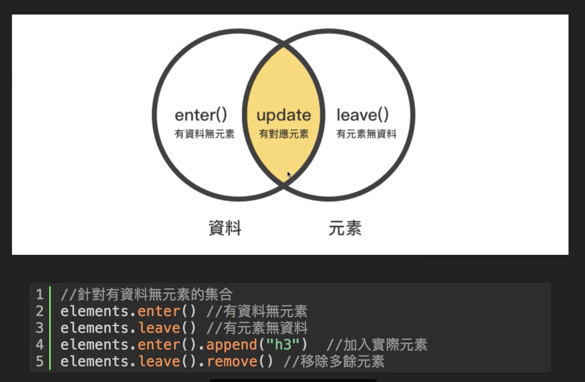

---
last_update:
  date: 2023/11/20
title: D3.js
description: D3.js
keywords: [d3]
---

# D3.js

- 全名為（Data-Driven Documents）
- 
- `scaleLinear` / `scaleLog` 線性/指數縮放
  - domain 輸入數值範圍
  - range 輸出範圍
- `scaleLinear()` 用線性的方式顯示；`scaleOrdinal()` 會是以序列來顯示
- `d3.range(10)` 可以產生 0~9 的內容陣列
- 練習內容 [codesandbox](https://codesandbox.io/s/d3-practice-3fp59k)、[SVG 練習](https://codesandbox.io/s/d3-svg-sytfxh?file=/index.html)

### 參考資料

- [單元 7 - D3.js 視覺化資料的利器 (入門)](https://hahow.in/courses/586fae97a8aae907000ce721/discussions?item=5a1e1755a2c4b000589dda4f)
- [單元 7 - D3.js 視覺化資料的利器 (入門) - 講義](https://hackmd.io/@frank890417/S1-vUm_7m?type=view)
