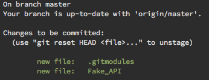
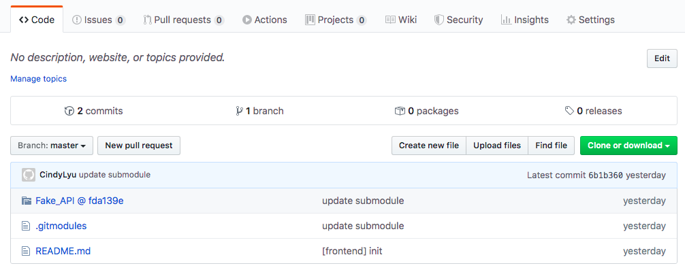

# submodule

### 新增 submodule

到該專案底下輸入指令

```bash
$ git submodule add <respository>

$ git submodule add https://github.com/CindyLyu/Fake_API.git
```

就會在該專案內發現多了一個檔案  .gitmodule，打開來內容會有

```bash
[submodule "Fake_API"]
 path = Fake_API
 url = https://github.com/CindyLyu/Fake_API.git
```

並且也會發現多一個 Fake_API 的資料夾（很隨意找的一個 repository 當作 submodule）
在 commit 時也會發現有這兩個新的內容需要一起 commit



commit 完並 push 上去 GitHub 時就會發現在剛剛新增的 Fake_API 多個 @ 符號，點進去也會直接連結到 Fake_API 這個 repository 裡面（解開之前想說為何看到別人的 repository 中的資料夾會有 @ 的疑問）



### 更新 submodule

當 submodule （範例中的 Fake_API）有更新內容後，要同步更新到目前 repository 中的 submodule 就要像平常 pull 下來的方式一樣。
先切換到 Fake_API 目錄底下，在執行指令

```bash
$ git pull origin master
```

來更新 submodule，並且在之後 commit 的時候一起將 submodule 更新的部分做 commit。

### 當 clone 專案並含有 submodule 時

clone 下來雖然也會包含 submodule 的目錄及  .gitmodules 檔案，但會發現 點進 submodule 目錄後是空的內容。
這時候會需要先執行指令

```bash
$ git submodule init
```

執行完 submodule init 就會發現在  .git/config 檔案中多 submodule 的相關資訊

```bash
[submodule "Fake_API"]
 active = true
 url = https://github.com/CindyLyu/Fake_API.git
```

接著執行

```bash
$ git submodule update
```

就會將 submodule 目錄同步更新了！

### 參考資料

- [Git Submodule 介紹與使用](https://blog.wu-boy.com/2011/09/introduction-to-git-submodule/)
- [git document](https://git-scm.com/docs/git-submodule)
